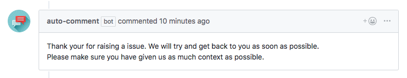

<p align="center">
  
  <h3 align="center"><a href="https://github.com/marketplace/auto-comment">auto-comment</a></h3>
  <p align="center">A GitHub App built with <a href="https://github.com/probot/probot">Probot</a> that comments on new issues and pull requests based on your configuration.<p>
  <p align="center"><a href="https://travis-ci.org/boyney123/auto-comment"></a>
    <a href="https://codecov.io/gh/boyney123/auto-comment/"></a>
    <a href="https://opensource.org/licenses/MIT"></a>
 
  </p>
</p>



## Usage

Using **auto-comment** is simple. Once you've installed it in your repository you will need to setup your `.github/auto-comment.yml` file and **auto-comment** will do the rest.

## Configuring for your project

There are a couple of configuration options that you will need to setup depending on what you want.

```yml
# Comment to a new issue.
issuesOpened: >
  Thank you for raising an issue. We will try and get back to you as soon as possible.

  Please make sure you have given us as much context as possible.

pullRequestOpened: >
  Thank you for raising your pull request.

  Please make sure you have followed our contributing guidelines. We will review it as soon as possible.
```

### Available options for Issues

| Name               | Description                                    |
| ------------------ | ---------------------------------------------- |
| issuesOpened       | Message when issues are created.               |
| issuesClosed       | Message when be shown when the issue is closed |
| issuesLabeled      | Message when issues are labeled                |
| issuesUnlabeled    | Message when issues are unlabeled              |
| issuesEdited       | Message when issues are edited                 |
| issuesMilestoned   | Message when issues have been milestoned       |
| issuesDemilestoned | Message when issues have been demilestoned     |
| issuesClosed       | Message when issues are closed                 |
| issuesReopened     | Message when issues are reopened               |
| issuesAssigned     | Message when issues are assigned               |
| issuesUnassigned   | Message when issues are unassigned             |

### Available options for Pull Requests

| Name                            | Description                                                    |
| ------------------------------- | -------------------------------------------------------------- |
| pullRequestOpened               | Message when pull requests are opened .                        |
| pullRequestClosed               | Message when be shown when the issue is closed                 |
| pullRequestReviewRequested      | Message when be shown when a reviewer has been requested       |
| pullRequestReviewRequestRemoved | Message when be shown when a reviewer request has been removed |
| pullRequestLabeled              | Message when pullRequest are labeled                           |
| pullRequestUnlabeled            | Message when pullRequest are unlabeled                         |
| pullRequestEdited               | Message when pullRequest are edited                            |
| pullRequestClosed               | Message when pullRequest are closed                            |
| pullRequestReopened             | Message when pullRequest are reopened                          |
| pullRequestAssigned            | Message when pullRequests are assigned                         |
| pullRequestUnassigned          | Message when pullRequests are unassigned                       |
